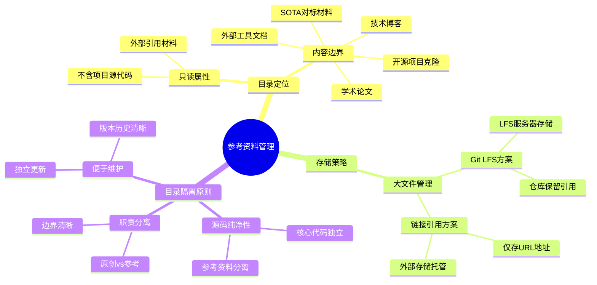

# 参考资料管理

## 定义

参考资料管理是指在软件项目开发过程中，对外部获取的技术资料进行系统性收集、分类、存储和维护的一整套方法论和实践规范。这些外部资料包括但不限于开源项目源码、学术论文、技术博客、标准规范文档、竞品分析材料等。

从本质上看，参考资料管理是项目知识治理的重要组成部分。它与代码管理、文档管理共同构成项目知识资产的三驾马车。优秀的参考资料管理能够让团队成员快速定位所需的技术参考材料，降低重复学习和信息检索成本，同时确保项目知识资产的可追溯性和可复用性。

参考资料管理的核心特征包括：**只读性**（参考资料是外部来源的引用，而非项目自身代码）、**集中性**（通过统一入口管理，避免资料散落各处）、**规范性**（建立明确的分类体系和存储策略）、**可维护性**（定期更新和清理过时资料）。

## 解决什么问题

在软件项目中，参考资料管理不善会带来一系列问题：

**目录结构混乱**：当参考资料与源代码混合存放时，开发者难以区分哪些是项目原创代码，哪些是外部引用材料。这不仅增加了代码审查的复杂度，还可能导致LICENSE合规问题——将开源代码误认为是项目代码进行修改或商业发布。

**知识传承断层**：当团队核心成员离职时，其积累的技术资料如果散落在个人文件夹、即时通讯记录或邮件附件中，新成员难以快速继承这些知识。项目可能因此陷入"重复造轮子"的困境，或者在技术选型时缺乏参考依据。

**版本库膨胀**：大型参考资料（如预训练模型、数据集、视频素材）直接提交到Git仓库会导致仓库体积急剧膨胀，影响克隆速度和新成员入职效率。同时，每次资料更新都会触发不必要的仓库同步，浪费带宽和时间。

**资料检索困难**：缺乏统一管理的参考资料容易出现"我知道存在，但找不到"的情况。重复下载同一份资料也造成资源浪费。资料之间缺乏关联标注，无法形成知识网络。

**版本过期风险**：外部参考资料会持续更新，如果缺乏版本锁定机制，项目引用的资料可能悄无声息地发生变化，导致之前有效的方案突然失效。

## 工作原理

### 目录隔离机制

参考资料管理的核心原理是通过物理或逻辑隔离，将外部参考资料与项目源代码划分为两个独立的管理域。这种隔离在项目结构层面体现为独立的目录命名（如 `reference/`、`docs/`、`external/`），在版本控制层面则体现为不同的处理策略。

```
项目根目录/
├── src/                    # 源代码目录（只包含项目自身代码）
├── tests/                  # 测试代码目录
├── reference/              # 参考资料目录（外部材料的集中存放区）
│   ├── papers/            # 学术论文
│   ├── open-source/       # 开源项目克隆
│   ├── blogs/             # 技术博客摘录
│   └── specs/             # 技术规范文档
├── docs/                   # 项目自身文档
└── README.md               # 项目入口文档
```

隔离机制的价值在于：

1. **职责边界清晰**：开发者可以立即判断文件属性（"这是我们写的代码"还是"这是外部参考"）
2. **构建策略灵活**：CI/CD流程可以灵活选择是否包含reference/目录
3. **按需克隆**：Git支持只克隆源码而排除大型参考资料
4. **权限分离**：不同团队成员可能对源码和参考资料有不同的访问权限

### 分类组织体系

参考资料需要按照一定的维度进行分类组织，常见的分类维度包括：

| 分类维度 | 说明 | 示例 |
|---------|------|------|
| **资料类型** | 按内容形式分类 | 论文、博客、源码、规范、视频 |
| **技术领域** | 按所属技术栈分类 | 前端、后端、机器学习、DevOps |
| **应用场景** | 按使用目的分类 | 技术选型参考、竞品分析、学习资料 |
| **时效性** | 按更新频率分类 | 静态资料、动态资料 |

一个良好的分类体系应该具备以下特征：**互斥性**（每份资料归属唯一分类）、**扩展性**（能够容纳新增资料类型）、**直观性**（分类名称自解释，无需额外说明）。

### 存储策略分层

根据参考资料的大小和更新频率，采用差异化的存储策略：

**常规文件（<10MB）**：直接纳入版本控制，与源码一同管理。适用于小型文档、代码片段、配置示例等。

**大型二进制文件（>10MB）**：采用Git LFS（Large File Storage）方案，将文件内容存储在独立的LFS服务器，仓库中仅保留轻量引用。这种方式保留了版本控制能力，同时避免仓库膨胀。

```
# .gitattributes 配置示例
*.zip filter=lfs diff=lfs merge=lfs -text
*.pdf filter=lfs diff=lfs merge=lfs -text
*.mp4 filter=lfs diff=lfs merge=lfs -text
*.pt filter=lfs diff=lfs merge=lfs -text  # PyTorch模型
*.h5 filter=lfs diff=lfs merge=lfs -text  # Keras模型
```

**超大型文件或外部托管资源**：仅保留链接引用（如云存储URL、官方网站下载地址），文件本体存放在外部服务。这种方式完全避免了对仓库的影响，但需要确保链接长期有效。

### 版本锁定机制

为确保参考资料的可追溯性，建议采用以下版本锁定策略：

**Git提交哈希锁定**：对于克隆的开源项目，记录其Git提交哈希或版本标签。

```
# 参考资料元数据文件示例
{
  "repository": "https://github.com/example/lib",
  "version": "v2.1.0",
  "commit_hash": "a1b2c3d4e5f6",
  "retrieved_date": "2026-03-15",
  "license": "MIT",
  "purpose": "作为JSON解析库的技术选型参考"
}
```

**外部链接时间戳**：对于仅保留链接的参考资料，记录访问日期，便于后续追溯。

## 关键方法

### 方法一：集中式目录管理

在项目根目录建立统一的 `reference/` 目录，作为所有外部参考资料的唯一入口。这种方法简单直观，适合中小型项目。

**实施步骤**：

1. 创建 `reference/` 目录及子分类目录
2. 编写 `reference/README.md` 说明目录结构和使用规范
3. 配置 `.gitignore` 确保 reference/ 目录与源码目录正确关联
4. 将现有散落的参考资料迁移至统一目录
5. 向团队推广使用规范

**适用场景**：团队规模小于20人，参考资料总量小于1GB。

### 方法二：独立仓库管理

将参考资料作为独立的项目仓库进行管理，主项目通过Git子模块（Submodule）或包管理器引用。这种方法适合大型团队和资料量巨大的场景。

**实施步骤**：

1. 创建独立的 `project-references` 仓库
2. 在主项目中添加子模块引用
3. 建立参考资料仓库的独立维护流程
4. 配置CI/CD自动同步更新

```bash
# 添加参考资料子模块
git submodule add https://github.com/team/project-references.git reference
git submodule update --init --recursive
```

**适用场景**：多项目共享参考资料，或者参考资料需要独立版本发布。

### 方法三：知识库平台集成

借助Confluence、Notion、GitBook等知识库平台管理参考资料，项目中仅保留平台链接。这种方法适合强调知识检索和协作的场景。

**实施步骤**：

1. 搭建团队知识库平台
2. 建立参考资料分类体系
3. 配置访问权限和搜索功能
4. 在项目中通过文档链接引用

**适用场景**：强调知识沉淀和检索的团队，需要与文档管理紧密结合。

## 典型应用

### 应用场景一：技术选型参考

在项目启动阶段，团队需要对多个技术方案进行调研和对比。参考资料管理可以将调研过程产生的资料集中保存，便于后续决策追溯和方案回溯。

**示例流程**：

1. 调研期间，将各方案的官方文档、对比评测文章、社区讨论收集至 `reference/tech-research/`
2. 为每份资料添加简要说明标签（"性能表现"、"生态成熟度"、"学习曲线"）
3. 决策完成后，在项目Wiki中记录最终选择的理由和参考依据
4. 将决策相关的参考资料标记为"已评审"，其他资料保留供后续参考

**价值体现**：当项目后续遇到性能问题或需要切换技术方案时，可以快速回溯当初的调研结论和决策依据。

### 应用场景二：代码复用参考

开发过程中，团队经常需要参考开源项目的实现方式。通过规范化的参考资料管理，可以将参考的代码片段、API使用示例集中保存，形成团队的"代码模式库"。

**示例结构**：

```
reference/
└── code-patterns/
    ├── api-design/
    │   ├── restful-best-practices.md
    │   └── graphql-schema-design.md
    ├── testing/
    │   ├── unit-test-examples/
    │   └── e2e-test-patterns.md
    └── architecture/
        ├── microservices-patterns.md
        └── event-driven-design.md
```

**价值体现**：新成员可以通过学习这些代码模式快速理解团队的编码规范，同时避免重复从海量互联网资料中检索。

## 与其他概念的对比

### 参考资料管理 vs 文档管理

| 对比维度 | 参考资料管理 | 文档管理 |
|---------|-------------|----------|
| **内容属性** | 外部来源的只读材料 | 项目自身编写的文档 |
| **所有权** | 通常不归属项目团队 | 归属项目团队 |
| **更新频率** | 被动跟随外部来源更新 | 主动维护更新 |
| **存储位置** | 通常在 reference/ 目录 | 通常在 docs/ 目录 |
| **版本控制** | 可能需要锁定外部版本 | 项目内部版本管理 |

两者虽然都涉及"资料管理"，但侧重点不同。文档管理关注项目自身知识的沉淀和传承，而参考资料管理关注外部知识的收集和引用。在实际项目中，两者往往协同使用，共同构成项目的知识体系。

### 参考资料管理 vs 依赖管理

| 对比维度 | 参考资料管理 | 依赖管理 |
|---------|-------------|----------|
| **管理对象** | 参考性质的材料（文档、代码片段） | 可执行依赖（库、包、模块） |
| **使用方式** | 人工查阅参考 | 代码直接引用 |
| **版本控制** | 可选 | 必须 |
| **安全影响** | 间接（影响开发决策） | 直接（影响运行时安全） |
| **工具支持** | 目录规范、知识库 | npm、pip、Maven等 |

依赖管理是参考资料管理在"可执行依赖"领域的专门化。两者的管理原则有相通之处，但具体实践方法和工具支持有显著差异。

## 常见误区

### 误区一：参考资料越多越好

很多团队陷入"囤积资料"的误区，认为收集的资料越多代表团队知识积累越丰富。实际上，过多的参考资料反而会造成检索负担，导致真正有价值的资料被淹没在信息海洋中。

**正确做法**：建立资料准入和淘汰机制，定期（如每季度）审视参考资料的有效性，清理过时或重复的材料。

### 误区二：所有资料都纳入版本控制

将大型二进制资料（如预训练模型、数据集）直接提交到Git仓库是常见错误。这会导致仓库体积膨胀，影响所有成员的Git操作性能。

**正确做法**：根据文件大小和更新频率选择合适的存储策略（Git LFS或外部链接），避免仓库污染。

### 误区三：忽视资料来源标注

参考资料管理不仅是"存放"，更重要的是"溯源"。缺少来源标注的资料在后续使用时可能引发合规问题（如GPL传染），或者难以验证资料的可信度。

**正确做法**：为每份参考资料添加元数据标签，包括来源URL、获取日期、作者、许可证类型等信息。

### 误区四：参考资料与项目文档混为一谈

有些团队将项目自身编写的API文档、架构设计说明与外部参考资料混存在同一目录，削弱了文档的权威性，也不便于区分"我们写的"和"我们参考的"。

**正确做法**：严格划分 `docs/`（项目自身文档）和 `reference/`（外部参考资料）的边界，保持目录职责单一。

## 关联知识

### 上位概念

- [[concept-knowledge-management]]（知识管理）：参考资料管理是知识管理在软件开发领域的具体应用

### 相关概念

- [[concept-project-structure]]（项目结构设计）：了解如何合理划分项目目录结构
- [[concept-documentation-structure]]（文档结构设计）：掌握项目文档的整体规划
- [[concept-version-control-best-practices]]（版本控制最佳实践）：学习Git在大文件处理和子模块管理方面的最佳实践

### 相关实体

- [[entity-git-lfs]]（Git大文件存储）：处理大型参考资料存储的技术工具
- [[entity-reference-directory]]（reference/目录）：参考资料管理的物理载体
- [[src-20260502-readme]]（项目参考目录规范）：本文档的原始资料来源

## 待探讨

### 资料淘汰机制

参考资料会随时间过期，但何时应该删除、如何确认"已无用"缺乏明确标准。是否可以建立基于项目生命周期的资料有效期机制？

### 团队协作模式

参考资料管理是集中式（由专人维护）还是分布式（各人管理自己的参考资料）更有效？如何在效率和规范之间取得平衡？

### 与AI辅助学习的结合

随着AI技术的发展，是否可以利用大语言模型对参考资料进行自动摘要、关联分析，生成"参考资料知识图谱"，提升资料检索效率？

## 来源

本概念页面的主要参考来源为项目根目录下 `reference/README.md` 文件中描述的参考资料目录治理规范[^1]。

[^1]: src-20260502-readme, "项目参考资料的目录治理规范", 2026-05-02.


<div align="right" style="opacity: 0.5; font-size: 0.8em;">✨ <i>Compiled by MiniMax-M2.7-highspeed</i></div>


## 图示



> 参考资料管理的核心要素思维导图，展示目录定位、存储策略和隔离原则三个维度
